##  Отчет по лабораторной работе №5

1. База данных для классификации: https://archive.ics.uci.edu/ml/datasets/Letter+Recognition
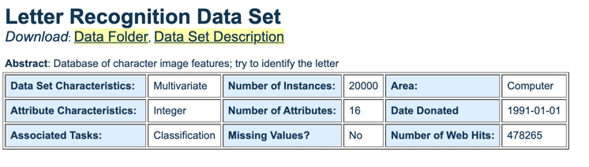
2. Выбранные классификаторы:
* Наи́вный ба́йесовский классифика́тор — простой вероятностный классификатор, основанный на применении теоремы Байеса со строгими (наивными) предположениями о независимости.
*  Метод опорных векторов (англ. SVM, support vector machine) — набор схожих алгоритмов обучения с учителем, использующихся для задач классификации и регрессионного анализа.
* Метод k-ближайших соседей (англ. k-nearest neighbors algorithm, k-NN) — метрический алгоритм для автоматической классификации объектов или регрессии.

3. Для обучения взяты все признаки
4. Справка по бд, ее атрибутам и классам дана в файле <em> letter-recognition.names </em>
5. Информация по данным:

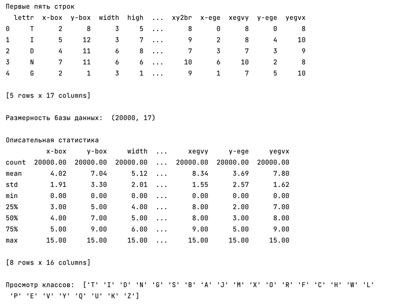

6. Выделим из бд материал для обучающей и тестовой выборок:

<code>X_train, X_test, y_train, y_test = train_test_split(X, y, test_size=0.3) </code>

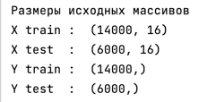

7. Анализ входных данных:

Было проведено сканирование различных шрифтов, они могли располагаться под наклоном.
Информация по ним, разбитая на 16 целочисленных параметров, представлена в большом количестве для каждой буквы

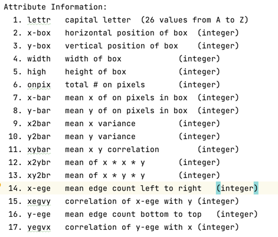

8. Анализ результатов:
* Наивный байесовкий классификатор

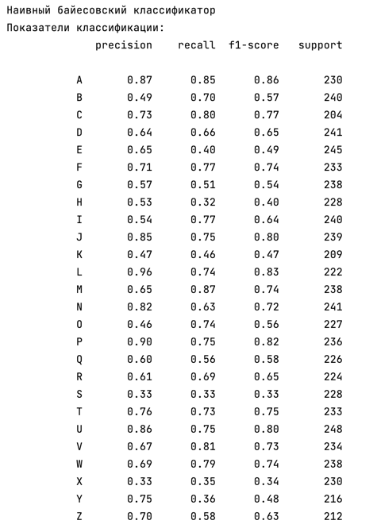

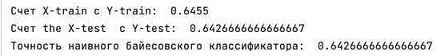

График:

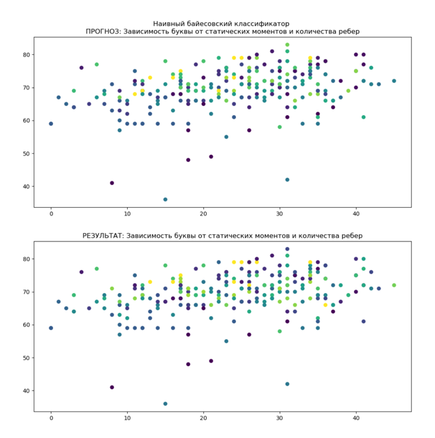

* Метод опорных векторов

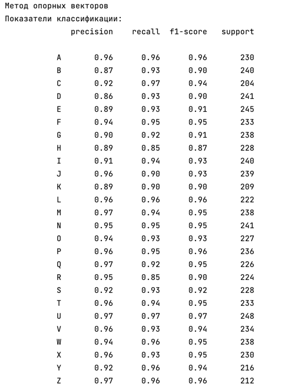

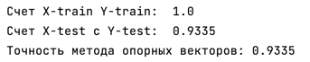

График:

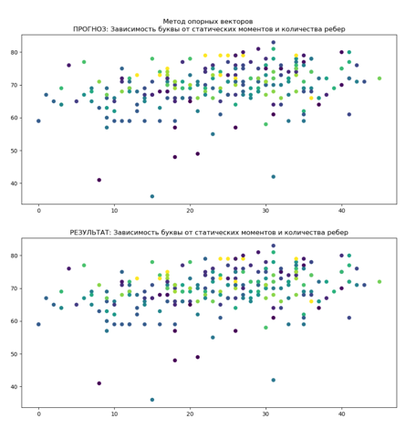

* Метод ближайших соседей

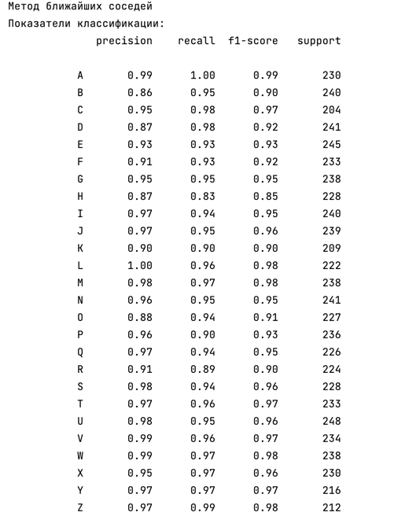

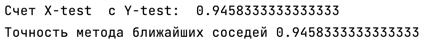

График:

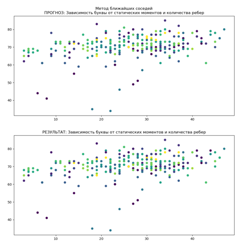

